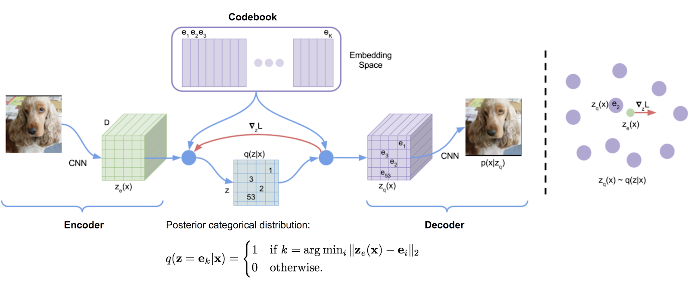
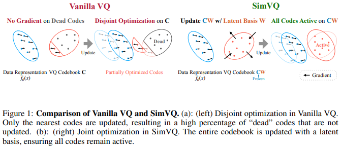
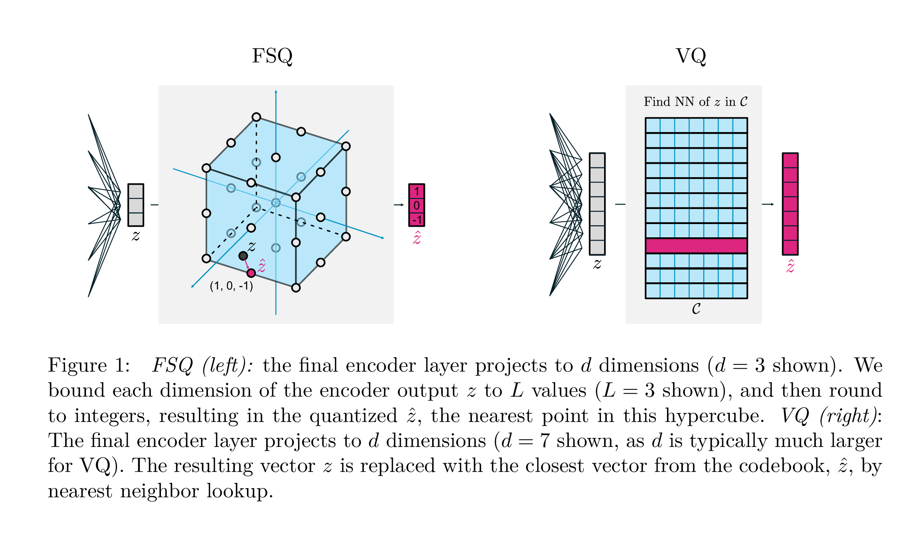

</img>

## Vector Quantization - Pytorch

A vector quantization library originally transcribed from Deepmind's tensorflow implementation, made conveniently into a package. It uses exponential moving averages to update the dictionary.

VQ has been successfully used by Deepmind and OpenAI for high quality generation of images (VQ-VAE-2) and music (Jukebox).

## Install

```bash
$ pip install vector-quantize-pytorch
```

## Usage

```python
import torch
from vector_quantize_pytorch import VectorQuantize

vq = VectorQuantize(
    dim = 256,
    codebook_size = 512,     # codebook size
    decay = 0.8,             # the exponential moving average decay, lower means the dictionary will change faster
    commitment_weight = 1.   # the weight on the commitment loss
)

x = torch.randn(1, 1024, 256)
quantized, indices, commit_loss = vq(x) # (1, 1024, 256), (1, 1024), (1)

```

## Residual VQ

This <a href="https://arxiv.org/abs/2107.03312">paper</a> proposes to use multiple vector quantizers to recursively quantize the residuals of the waveform. You can use this with the `ResidualVQ` class and one extra initialization parameter.

```python
import torch
from vector_quantize_pytorch import ResidualVQ

residual_vq = ResidualVQ(
    dim = 256,
    num_quantizers = 8,      # specify number of quantizers
    codebook_size = 1024,    # codebook size
)

x = torch.randn(1, 1024, 256)

quantized, indices, commit_loss = residual_vq(x)
print(quantized.shape, indices.shape, commit_loss.shape)
# (1, 1024, 256), (1, 1024, 8), (1, 8)

# if you need all the codes across the quantization layers, just pass return_all_codes = True

quantized, indices, commit_loss, all_codes = residual_vq(x, return_all_codes = True)

# (8, 1, 1024, 256)
```

Furthermore, <a href="https://arxiv.org/abs/2203.01941">this paper</a> uses Residual-VQ to construct the RQ-VAE, for generating high resolution images with more compressed codes.

They make two modifications. The first is to share the codebook across all quantizers. The second is to stochastically sample the codes rather than always taking the closest match. You can use both of these features with two extra keyword arguments.

```python
import torch
from vector_quantize_pytorch import ResidualVQ

residual_vq = ResidualVQ(
    dim = 256,
    num_quantizers = 8,
    codebook_size = 1024,
    stochastic_sample_codes = True,
    sample_codebook_temp = 0.1,         # temperature for stochastically sampling codes, 0 would be equivalent to non-stochastic
    shared_codebook = True              # whether to share the codebooks for all quantizers or not
)

x = torch.randn(1, 1024, 256)
quantized, indices, commit_loss = residual_vq(x)

# (1, 1024, 256), (1, 1024, 8), (1, 8)
```

<a href="https://arxiv.org/abs/2305.02765">A recent paper</a> further proposes to do residual VQ on groups of the feature dimension, showing equivalent results to Encodec while using far fewer codebooks. You can use it by importing `GroupedResidualVQ`

```python
import torch
from vector_quantize_pytorch import GroupedResidualVQ

residual_vq = GroupedResidualVQ(
    dim = 256,
    num_quantizers = 8,      # specify number of quantizers
    groups = 2,
    codebook_size = 1024,    # codebook size
)

x = torch.randn(1, 1024, 256)

quantized, indices, commit_loss = residual_vq(x)

# (1, 1024, 256), (2, 1, 1024, 8), (2, 1, 8)
```

## Initialization

The SoundStream paper proposes that the codebook should be initialized by the kmeans centroids of the first batch. You can easily turn on this feature with one flag `kmeans_init = True`, for either `VectorQuantize` or `ResidualVQ` class

```python
import torch
from vector_quantize_pytorch import ResidualVQ

residual_vq = ResidualVQ(
    dim = 256,
    codebook_size = 256,
    num_quantizers = 4,
    kmeans_init = True,   # set to True
    kmeans_iters = 10     # number of kmeans iterations to calculate the centroids for the codebook on init
)

x = torch.randn(1, 1024, 256)
quantized, indices, commit_loss = residual_vq(x)

# (1, 1024, 256), (1, 1024, 4), (1, 4)
```

## Gradient Computation

VQ-VAEs are traditionally trained with the straight-through estimator (STE). During the backwards pass, the gradient flows _around_ the VQ layer rather than _through_ it. The <a href="https://arxiv.org/abs/2410.06424">rotation trick paper</a> proposes to transform the gradient _through_ the VQ layer so the relative angle and magnitude between the input vector and quantized output are encoded into the gradient. You can enable or disable this feature with ```rotation_trick=True/False``` in the ```VectorQuantize``` class.

```python
from vector_quantize_pytorch import VectorQuantize

vq_layer = VectorQuantize(
    dim = 256,
    codebook_size = 256,
    rotation_trick = True,   # Set to False to use the STE gradient estimator or True to use the rotation trick.
)
```

## Increasing codebook usage

This repository will contain a few techniques from various papers to combat "dead" codebook entries, which is a common problem when using vector quantizers.

### Lower codebook dimension

The <a href="https://openreview.net/forum?id=pfNyExj7z2">Improved VQGAN paper</a> proposes to have the codebook kept in a lower dimension. The encoder values are projected down before being projected back to high dimensional after quantization. You can set this with the `codebook_dim` hyperparameter.

```python
import torch
from vector_quantize_pytorch import VectorQuantize

vq = VectorQuantize(
    dim = 256,
    codebook_size = 256,
    codebook_dim = 16      # paper proposes setting this to 32 or as low as 8 to increase codebook usage
)

x = torch.randn(1, 1024, 256)
quantized, indices, commit_loss = vq(x)

# (1, 1024, 256), (1, 1024), (1,)
```

### Cosine similarity

The <a href="https://openreview.net/forum?id=pfNyExj7z2">Improved VQGAN paper</a> also proposes to l2 normalize the codes and the encoded vectors, which boils down to using cosine similarity for the distance. They claim enforcing the vectors on a sphere leads to improvements in code usage and downstream reconstruction. You can turn this on by setting `use_cosine_sim = True`

```python
import torch
from vector_quantize_pytorch import VectorQuantize

vq = VectorQuantize(
    dim = 256,
    codebook_size = 256,
    use_cosine_sim = True   # set this to True
)

x = torch.randn(1, 1024, 256)
quantized, indices, commit_loss = vq(x)

# (1, 1024, 256), (1, 1024), (1,)
```

### Expiring stale codes

Finally, the SoundStream paper has a scheme where they replace codes that have hits below a certain threshold with randomly selected vector from the current batch. You can set this threshold with `threshold_ema_dead_code` keyword.

```python
import torch
from vector_quantize_pytorch import VectorQuantize

vq = VectorQuantize(
    dim = 256,
    codebook_size = 512,
    threshold_ema_dead_code = 2  # should actively replace any codes that have an exponential moving average cluster size less than 2
)

x = torch.randn(1, 1024, 256)
quantized, indices, commit_loss = vq(x)

# (1, 1024, 256), (1, 1024), (1,)
```

### Orthogonal regularization loss

VQ-VAE / VQ-GAN is quickly gaining popularity. A <a href="https://arxiv.org/abs/2112.00384">recent paper</a> proposes that when using vector quantization on images, enforcing the codebook to be orthogonal leads to translation equivariance of the discretized codes, leading to large improvements in downstream text to image generation tasks.

You can use this feature by simply setting the `orthogonal_reg_weight` to be greater than `0`, in which case the orthogonal regularization will be added to the auxiliary loss outputted by the module.

```python
import torch
from vector_quantize_pytorch import VectorQuantize

vq = VectorQuantize(
    dim = 256,
    codebook_size = 256,
    accept_image_fmap = True,                   # set this true to be able to pass in an image feature map
    orthogonal_reg_weight = 10,                 # in paper, they recommended a value of 10
    orthogonal_reg_max_codes = 128,             # this would randomly sample from the codebook for the orthogonal regularization loss, for limiting memory usage
    orthogonal_reg_active_codes_only = False    # set this to True if you have a very large codebook, and would only like to enforce the loss on the activated codes per batch
)

img_fmap = torch.randn(1, 256, 32, 32)
quantized, indices, loss = vq(img_fmap) # (1, 256, 32, 32), (1, 32, 32), (1,)

# loss now contains the orthogonal regularization loss with the weight as assigned
```

### Multi-headed VQ

There has been a number of papers that proposes variants of discrete latent representations with a multi-headed approach (multiple codes per feature). I have decided to offer one variant where the same codebook is used to vector quantize across the input dimension `head` times.

You can also use a more proven approach (memcodes) from <a href="https://github.com/lucidrains/nwt-pytorch">NWT paper</a>

```python
import torch
from vector_quantize_pytorch import VectorQuantize

vq = VectorQuantize(
    dim = 256,
    codebook_dim = 32,                  # a number of papers have shown smaller codebook dimension to be acceptable
    heads = 8,                          # number of heads to vector quantize, codebook shared across all heads
    separate_codebook_per_head = True,  # whether to have a separate codebook per head. False would mean 1 shared codebook
    codebook_size = 8196,
    accept_image_fmap = True
)

img_fmap = torch.randn(1, 256, 32, 32)
quantized, indices, loss = vq(img_fmap)

# (1, 256, 32, 32), (1, 32, 32, 8), (1,)

```

### Random Projection Quantizer

<a href="https://arxiv.org/abs/2202.01855">This paper</a> first proposed to use a random projection quantizer for masked speech modeling, where signals are projected with a randomly initialized matrix and then matched with a random initialized codebook. One therefore does not need to learn the quantizer. This technique was used by Google's <a href="https://ai.googleblog.com/2023/03/universal-speech-model-usm-state-of-art.html">Universal Speech Model</a> to achieve SOTA for speech-to-text modeling.

USM further proposes to use multiple codebook, and the masked speech modeling with a multi-softmax objective. You can do this easily by setting `num_codebooks` to be greater than 1

```python
import torch
from vector_quantize_pytorch import RandomProjectionQuantizer

quantizer = RandomProjectionQuantizer(
    dim = 512,               # input dimensions
    num_codebooks = 16,      # in USM, they used up to 16 for 5% gain
    codebook_dim = 256,      # codebook dimension
    codebook_size = 1024     # codebook size
)

x = torch.randn(1, 1024, 512)
indices = quantizer(x)

# (1, 1024, 16)
```

This repository should also automatically synchronizing the codebooks in a multi-process setting. If somehow it isn't, please open an issue. You can override whether to synchronize codebooks or not by setting `sync_codebook = True | False`

### Sim VQ

</img>

A <a href="https://arxiv.org/abs/2411.02038">new paper</a> proposes a scheme where the codebook is frozen, and the codes are implicitly generated through a linear projection. The authors claim this setup leads to less codebook collapse as well as easier convergence. I have found this to perform even better when paired with <a href="https://arxiv.org/abs/2410.06424">rotation trick</a> from Fifty et al., and expanding the linear projection to a small one layer MLP. You can experiment with it as so

Update: hearing mixed results

```python
import torch
from vector_quantize_pytorch import SimVQ

sim_vq = SimVQ(
    dim = 512,
    codebook_size = 1024,
    rotation_trick = True  # use rotation trick from Fifty et al.
)

x = torch.randn(1, 1024, 512)
quantized, indices, commit_loss = sim_vq(x)

assert x.shape == quantized.shape
assert torch.allclose(quantized, sim_vq.indices_to_codes(indices), atol = 1e-6)
```

For the residual flavor, just import `ResidualSimVQ` instead

```python
import torch
from vector_quantize_pytorch import ResidualSimVQ

residual_sim_vq = ResidualSimVQ(
    dim = 512,
    num_quantizers = 4,
    codebook_size = 1024,
    rotation_trick = True  # use rotation trick from Fifty et al.
)

x = torch.randn(1, 1024, 512)
quantized, indices, commit_loss = residual_sim_vq(x)

assert x.shape == quantized.shape
assert torch.allclose(quantized, residual_sim_vq.get_output_from_indices(indices), atol = 1e-6)
```

### Finite Scalar Quantization

</img>

|                  | VQ | FSQ |
|------------------|----|-----|
| Quantization     | argmin_c \|\| z-c \|\| | round(f(z)) |
| Gradients        | Straight Through Estimation (STE) | STE |
| Auxiliary Losses | Commitment, codebook, entropy loss, ... | N/A |
| Tricks           | EMA on codebook, codebook splitting, projections, ...| N/A |
| Parameters       | Codebook | N/A |

[This](https://arxiv.org/abs/2309.15505) work out of Google Deepmind aims to vastly simplify the way vector quantization is done for generative modeling, removing the need for commitment losses, EMA updating of the codebook, as well as tackle the issues with codebook collapse or insufficient utilization. They simply round each scalar into discrete levels with straight through gradients; the codes become uniform points in a hypercube.

Thanks goes out to [@sekstini](https://github.com/sekstini) for porting over this implementation in record time!

```python
import torch
from vector_quantize_pytorch import FSQ

quantizer = FSQ(
    levels = [8, 5, 5, 5]
)

x = torch.randn(1, 1024, 4) # 4 since there are 4 levels
xhat, indices = quantizer(x)

# (1, 1024, 4), (1, 1024)

assert torch.all(xhat == quantizer.indices_to_codes(indices))
```

An improvised Residual FSQ, for an attempt to improve audio encoding. 

Credit goes to [@sekstini](https://github.com/sekstini) for originally incepting the idea [here](https://github.com/lucidrains/vector-quantize-pytorch/pull/74#issuecomment-1742048597)

```python
import torch
from vector_quantize_pytorch import ResidualFSQ

residual_fsq = ResidualFSQ(
    dim = 256,
    levels = [8, 5, 5, 3],
    num_quantizers = 8
)

x = torch.randn(1, 1024, 256)

residual_fsq.eval()

quantized, indices = residual_fsq(x)

# (1, 1024, 256), (1, 1024, 8)

quantized_out = residual_fsq.get_output_from_indices(indices)

# (1, 1024, 256)

assert torch.all(quantized == quantized_out)
```

### Lookup Free Quantization

</img>

The research team behind <a href="https://arxiv.org/abs/2212.05199">MagViT</a> has released new SOTA results for generative video modeling. A core change between v1 and v2 include a new type of quantization, look-up free quantization (LFQ), which eliminates the codebook and embedding lookup entirely.

This paper presents a simple LFQ quantizer of using independent binary latents. Other implementations of LFQ exist. However, the team shows that MAGVIT-v2 with LFQ significantly improves on the ImageNet benchmark. The differences between LFQ and 2-level FSQ includes entropy regularizations as well as maintained commitment loss.

Developing a more advanced method of LFQ quantization without codebook-lookup could revolutionize generative modeling.

You can use it simply as follows. Will be dogfooded at <a href="https://github.com/lucidrains/magvit2-pytorch">MagViT2 pytorch port</a>

```python
import torch
from vector_quantize_pytorch import LFQ

# you can specify either dim or codebook_size
# if both specified, will be validated against each other

quantizer = LFQ(
    codebook_size = 65536,      # codebook size, must be a power of 2
    dim = 16,                   # this is the input feature dimension, defaults to log2(codebook_size) if not defined
    entropy_loss_weight = 0.1,  # how much weight to place on entropy loss
    diversity_gamma = 1.        # within entropy loss, how much weight to give to diversity of codes, taken from https://arxiv.org/abs/1911.05894
)

image_feats = torch.randn(1, 16, 32, 32)

quantized, indices, entropy_aux_loss = quantizer(image_feats, inv_temperature=100.)  # you may want to experiment with temperature

# (1, 16, 32, 32), (1, 32, 32), ()

assert (quantized == quantizer.indices_to_codes(indices)).all()
```

You can also pass in video features as `(batch, feat, time, height, width)` or sequences as `(batch, seq, feat)`

```python
import torch
from vector_quantize_pytorch import LFQ

quantizer = LFQ(
    codebook_size = 65536,
    dim = 16,
    entropy_loss_weight = 0.1,
    diversity_gamma = 1.
)

seq = torch.randn(1, 32, 16)
quantized, *_ = quantizer(seq)

assert seq.shape == quantized.shape

video_feats = torch.randn(1, 16, 10, 32, 32)
quantized, *_ = quantizer(video_feats)

assert video_feats.shape == quantized.shape
```

Or support multiple codebooks

```python
import torch
from vector_quantize_pytorch import LFQ

quantizer = LFQ(
    codebook_size = 4096,
    dim = 16,
    num_codebooks = 4  # 4 codebooks, total codebook dimension is log2(4096) * 4
)

image_feats = torch.randn(1, 16, 32, 32)

quantized, indices, entropy_aux_loss = quantizer(image_feats)

# (1, 16, 32, 32), (1, 32, 32, 4), ()

assert image_feats.shape == quantized.shape
assert (quantized == quantizer.indices_to_codes(indices)).all()
```

An improvised Residual LFQ, to see if it can lead to an improvement for audio compression.

```python
import torch
from vector_quantize_pytorch import ResidualLFQ

residual_lfq = ResidualLFQ(
    dim = 256,
    codebook_size = 256,
    num_quantizers = 8
)

x = torch.randn(1, 1024, 256)

residual_lfq.eval()

quantized, indices, commit_loss = residual_lfq(x)

# (1, 1024, 256), (1, 1024, 8), (8)

quantized_out = residual_lfq.get_output_from_indices(indices)

# (1, 1024, 256)

assert torch.all(quantized == quantized_out)
```

### Latent Quantization

Disentanglement is essential for representation learning as it promotes interpretability, generalization, improved learning, and robustness. It aligns with the goal of capturing meaningful and independent features of the data, facilitating more effective use of learned representations across various applications. For better disentanglement, the challenge is to disentangle underlying variations in a dataset without explicit ground truth information. This work introduces a key inductive bias aimed at encoding and decoding within an organized latent space. The strategy incorporated encompasses discretizing the latent space by assigning discrete code vectors through the utilization of an individual learnable scalar codebook for each dimension. This methodology enables their models to surpass robust prior methods effectively.

Be aware they had to use a very high weight decay for the results in this paper.

```python
import torch
from vector_quantize_pytorch import LatentQuantize

# you can specify either dim or codebook_size
# if both specified, will be validated against each other

quantizer = LatentQuantize(
    levels = [5, 5, 8],      # number of levels per codebook dimension
    dim = 16,                   # input dim
    commitment_loss_weight=0.1,  
    quantization_loss_weight=0.1,
)

image_feats = torch.randn(1, 16, 32, 32)

quantized, indices, loss = quantizer(image_feats)

# (1, 16, 32, 32), (1, 32, 32), ()

assert image_feats.shape == quantized.shape
assert (quantized == quantizer.indices_to_codes(indices)).all()
```

You can also pass in video features as `(batch, feat, time, height, width)` or sequences as `(batch, seq, feat)`

```python

import torch
from vector_quantize_pytorch import LatentQuantize

quantizer = LatentQuantize(
    levels = [5, 5, 8],
    dim = 16,
    commitment_loss_weight=0.1,  
    quantization_loss_weight=0.1,
)

seq = torch.randn(1, 32, 16)
quantized, *_ = quantizer(seq)

# (1, 32, 16)

video_feats = torch.randn(1, 16, 10, 32, 32)
quantized, *_ = quantizer(video_feats)

# (1, 16, 10, 32, 32)

```

Or support multiple codebooks

```python
import torch
from vector_quantize_pytorch import LatentQuantize

model = LatentQuantize(
    levels = [4, 8, 16],
    dim = 9,
    num_codebooks = 3
)

input_tensor = torch.randn(2, 3, dim)
output_tensor, indices, loss = model(input_tensor)

# (2, 3, 9), (2, 3, 3), ()

assert output_tensor.shape == input_tensor.shape
assert indices.shape == (2, 3, num_codebooks)
assert loss.item() >= 0
```

## Citations

```bibtex
@misc{oord2018neural,
    title   = {Neural Discrete Representation Learning},
    author  = {Aaron van den Oord and Oriol Vinyals and Koray Kavukcuoglu},
    year    = {2018},
    eprint  = {1711.00937},
    archivePrefix = {arXiv},
    primaryClass = {cs.LG}
}
```

```bibtex
@misc{zeghidour2021soundstream,
    title   = {SoundStream: An End-to-End Neural Audio Codec},
    author  = {Neil Zeghidour and Alejandro Luebs and Ahmed Omran and Jan Skoglund and Marco Tagliasacchi},
    year    = {2021},
    eprint  = {2107.03312},
    archivePrefix = {arXiv},
    primaryClass = {cs.SD}
}
```

```bibtex
@inproceedings{anonymous2022vectorquantized,
    title   = {Vector-quantized Image Modeling with Improved {VQGAN}},
    author  = {Anonymous},
    booktitle = {Submitted to The Tenth International Conference on Learning Representations },
    year    = {2022},
    url     = {https://openreview.net/forum?id=pfNyExj7z2},
    note    = {under review}
}
```

```bibtex
@inproceedings{lee2022autoregressive,
    title   = {Autoregressive Image Generation using Residual Quantization},
    author  = {Lee, Doyup and Kim, Chiheon and Kim, Saehoon and Cho, Minsu and Han, Wook-Shin},
    booktitle = {Proceedings of the IEEE/CVF Conference on Computer Vision and Pattern Recognition},
    pages   = {11523--11532},
    year    = {2022}
}
```

```bibtex
@article{Defossez2022HighFN,
    title   = {High Fidelity Neural Audio Compression},
    author  = {Alexandre D'efossez and Jade Copet and Gabriel Synnaeve and Yossi Adi},
    journal = {ArXiv},
    year    = {2022},
    volume  = {abs/2210.13438}
}
```

```bibtex
@inproceedings{Chiu2022SelfsupervisedLW,
    title   = {Self-supervised Learning with Random-projection Quantizer for Speech Recognition},
    author  = {Chung-Cheng Chiu and James Qin and Yu Zhang and Jiahui Yu and Yonghui Wu},
    booktitle = {International Conference on Machine Learning},
    year    = {2022}
}
```

```bibtex
@inproceedings{Zhang2023GoogleUS,
    title   = {Google USM: Scaling Automatic Speech Recognition Beyond 100 Languages},
    author  = {Yu Zhang and Wei Han and James Qin and Yongqiang Wang and Ankur Bapna and Zhehuai Chen and Nanxin Chen and Bo Li and Vera Axelrod and Gary Wang and Zhong Meng and Ke Hu and Andrew Rosenberg and Rohit Prabhavalkar and Daniel S. Park and Parisa Haghani and Jason Riesa and Ginger Perng and Hagen Soltau and Trevor Strohman and Bhuvana Ramabhadran and Tara N. Sainath and Pedro J. Moreno and Chung-Cheng Chiu and Johan Schalkwyk and Franccoise Beaufays and Yonghui Wu},
    year    = {2023}
}
```

```bibtex
@inproceedings{Shen2023NaturalSpeech2L,
    title   = {NaturalSpeech 2: Latent Diffusion Models are Natural and Zero-Shot Speech and Singing Synthesizers},
    author  = {Kai Shen and Zeqian Ju and Xu Tan and Yanqing Liu and Yichong Leng and Lei He and Tao Qin and Sheng Zhao and Jiang Bian},
    year    = {2023}
}
```

```bibtex
@inproceedings{Yang2023HiFiCodecGV,
    title   = {HiFi-Codec: Group-residual Vector quantization for High Fidelity Audio Codec},
    author  = {Dongchao Yang and Songxiang Liu and Rongjie Huang and Jinchuan Tian and Chao Weng and Yuexian Zou},
    year    = {2023}
}
```

```bibtex
@inproceedings{huh2023improvedvqste,
    title   = {Straightening Out the Straight-Through Estimator: Overcoming Optimization Challenges in Vector Quantized Networks},
    author  = {Huh, Minyoung and Cheung, Brian and Agrawal, Pulkit and Isola, Phillip},
    booktitle = {International Conference on Machine Learning},
    year    = {2023},
    organization = {PMLR}
}
```

```bibtex
@inproceedings{rogozhnikov2022einops,
    title   = {Einops: Clear and Reliable Tensor Manipulations with Einstein-like Notation},
    author  = {Alex Rogozhnikov},
    booktitle = {International Conference on Learning Representations},
    year    = {2022},
    url     = {https://openreview.net/forum?id=oapKSVM2bcj}
}
```

```bibtex
@misc{shin2021translationequivariant,
    title   = {Translation-equivariant Image Quantizer for Bi-directional Image-Text Generation},
    author  = {Woncheol Shin and Gyubok Lee and Jiyoung Lee and Joonseok Lee and Edward Choi},
    year    = {2021},
    eprint  = {2112.00384},
    archivePrefix = {arXiv},
    primaryClass = {cs.CV}
}
```

```bibtex
@misc{mentzer2023finite,
    title   = {Finite Scalar Quantization: VQ-VAE Made Simple},
    author  = {Fabian Mentzer and David Minnen and Eirikur Agustsson and Michael Tschannen},
    year    = {2023},
    eprint  = {2309.15505},
    archivePrefix = {arXiv},
    primaryClass = {cs.CV}
}
```

```bibtex
@misc{yu2023language,
    title   = {Language Model Beats Diffusion -- Tokenizer is Key to Visual Generation},
    author  = {Lijun Yu and José Lezama and Nitesh B. Gundavarapu and Luca Versari and Kihyuk Sohn and David Minnen and Yong Cheng and Agrim Gupta and Xiuye Gu and Alexander G. Hauptmann and Boqing Gong and Ming-Hsuan Yang and Irfan Essa and David A. Ross and Lu Jiang},
    year    = {2023},
    eprint  = {2310.05737},
    archivePrefix = {arXiv},
    primaryClass = {cs.CV}
}
```

```bibtex
@inproceedings{Zhao2024ImageAV,
  title     = {Image and Video Tokenization with Binary Spherical Quantization},
  author    = {Yue Zhao and Yuanjun Xiong and Philipp Krahenbuhl},
  year      = {2024},
  url       = {https://api.semanticscholar.org/CorpusID:270380237}
}
```

```bibtex
@misc{hsu2023disentanglement,
    title   = {Disentanglement via Latent Quantization}, 
    author  = {Kyle Hsu and Will Dorrell and James C. R. Whittington and Jiajun Wu and Chelsea Finn},
    year    = {2023},
    eprint  = {2305.18378},
    archivePrefix = {arXiv},
    primaryClass = {cs.LG}
}
```

```bibtex
@inproceedings{Irie2023SelfOrganisingND,
    title   = {Self-Organising Neural Discrete Representation Learning \`a la Kohonen},
    author  = {Kazuki Irie and R'obert Csord'as and J{\"u}rgen Schmidhuber},
    year    = {2023},
    url     = {https://api.semanticscholar.org/CorpusID:256901024}
}
```

```bibtex
@article{Huijben2024ResidualQW,
    title   = {Residual Quantization with Implicit Neural Codebooks},
    author  = {Iris Huijben and Matthijs Douze and Matthew Muckley and Ruud van Sloun and Jakob Verbeek},
    journal = {ArXiv},
    year    = {2024},
    volume  = {abs/2401.14732},
    url     = {https://api.semanticscholar.org/CorpusID:267301189}
}
```

```bibtex
@article{Fifty2024Restructuring,
    title   = {Restructuring Vector Quantization with the Rotation Trick},
    author  = {Christopher Fifty, Ronald G. Junkins, Dennis Duan, Aniketh Iyengar, Jerry W. Liu, Ehsan Amid, Sebastian Thrun, Christopher Ré},
    journal = {ArXiv},
    year    = {2024},
    volume  = {abs/2410.06424},
    url     = {https://api.semanticscholar.org/CorpusID:273229218}
}
```

```bibtex
@inproceedings{Zhu2024AddressingRC,
    title   = {Addressing Representation Collapse in Vector Quantized Models with One Linear Layer},
    author  = {Yongxin Zhu and Bocheng Li and Yifei Xin and Linli Xu},
    year    = {2024},
    url     = {https://api.semanticscholar.org/CorpusID:273812459}
}
```

```bibtex
@article{Parker2024ScalingTF,
    title   = {Scaling Transformers for Low-Bitrate High-Quality Speech Coding},
    author  = {Julian Parker and Anton Smirnov and Jordi Pons and CJ Carr and Zack Zukowski and Zach Evans and Xubo Liu},
    journal = {ArXiv},
    year    = {2024},
    volume  = {abs/2411.19842},
    url     = {https://api.semanticscholar.org/CorpusID:274423406}
}
```
